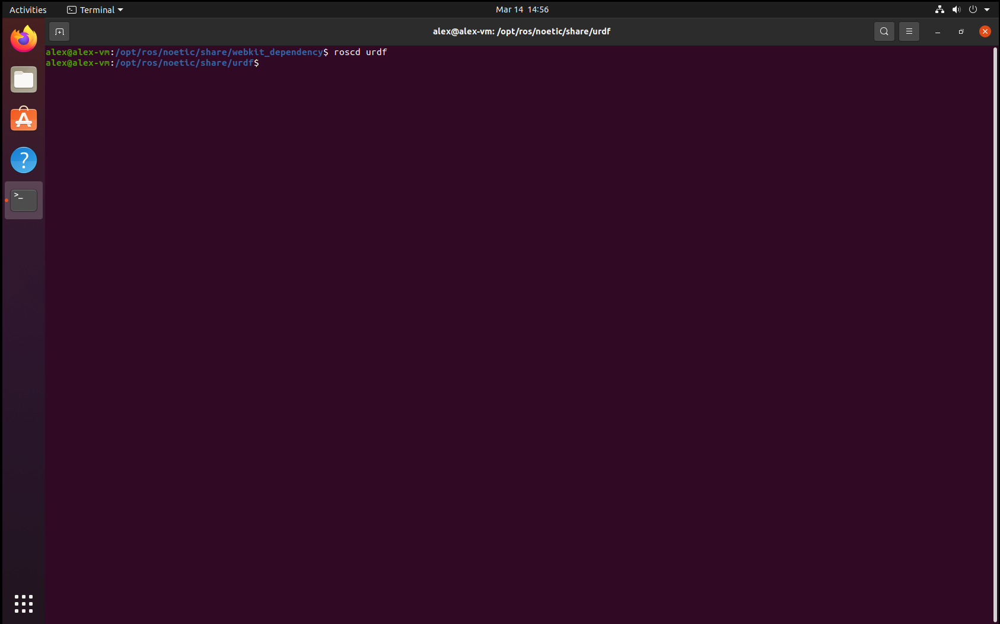

# Week 2

## 1.1 `rospack` and `rosls`

### 1.1.1

The output of this command shows the path to the `turtlesim` package.


### 1.1.2

This outputs all the available packages and their filepaths


### 1.1.3

xmlrpcpp /opt/ros/noetic/share/xmlrpcpp

xacro /opt/ros/noetic/share/xacro

webkit_dependency /opt/ros/noetic/share/webkit_dependency

visualization_msgs /opt/ros/noetic/share/visualization_msgs

visualization_marker_tutorials /option/ros/noetic/share/visualization_marker_tutorials

urdf_tutorial /opt/ros/noetic/share/urdf_tutorial

urdf_sim_tutorial /opt/ros/noetic/share/urdf_sim_tutorial

urdf_parser_plugin /opt/ros/noetic/share/urdf_parser_plugin

urdf /opt/ros/noetic/share/urdf

turtle_tf /opt/ros/noetic/share/turtle_tf

### 1.1.4

The output of the `rosls` command shows the contents of the package


_xmlrpcpp_


_xacro_


_webkit_dependency_


_urdf_


_turtle_tf_

## 1.2 `roscd`





## 2 `roscore` and `rosrun`

### 2.1


### 2.2

In `rosrun turtlesim turtlesim_node` the first `turtlesim` is the package and the `turtlesim_node` is the node. In `rosrun turtlesim turtlesim_teleop_key` `turtlesim_teleop_key` is the node name and `turtlesim` is the package name.

## 3 Getting information about nodes, topics and messages

## 3.1.1

The following nodes are running

```
/rosout
/teleop_turtle
/turtlesim
```

### 3.1.2

**Publications**  
```
/rosout [rosgraph_msgs/Log]
/turtle1/color_sensor [turtlesim/Color]
/turtle1/pose [turtlesim/Pose]
```

**Subscriptions**  
```
/turtle1/cmd_vel [geometry_msgs/Twist]
```

### 3.1.3

**Publications**  
```
/rosout [rosgraph_msgs/Log]
/turtle1/cmd_vel [geometry_msgs/Twist]
```

**Subscriptions**  
```
/teleop_turtle/get_loggers
/teleop_turtle/set_logger_level
```

### 3.2.1

```
/rosout
/rosout_agg
/turtle1/cmd_vel
/turtle1/color_sensor
/turtle1/pose
```

### 3.2.2

The `teleop_turtle` node is using the `turtle1/cmd_vel` topic to communicate with `turtlesim`. `turtle1/cmd_vel` listens to messages from `teleop_turtle` and `turtlesim` listens to messages from `turtle1/cmd_vel`.

### 3.2.3

`geometry_msgs/Twist`

### 3.3.1

```json
{
	"geometry_msgs/Vector3": {
		"linear": {
			"x": {},
			"y": {},
			"z": {}
		},
		"angular": {
			"x": {},
			"y": {},
			"z": {}
		}
	}
}
```

### 3.3.2

Topcis are a way of commuincating with other nodes via a named channel. Communication through these channels will relate only to these topics. A message contains information in a simplified format that ROS nodes can send between each other via topics.
