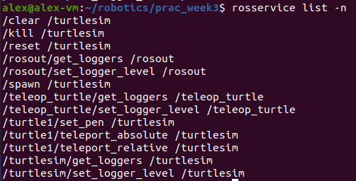
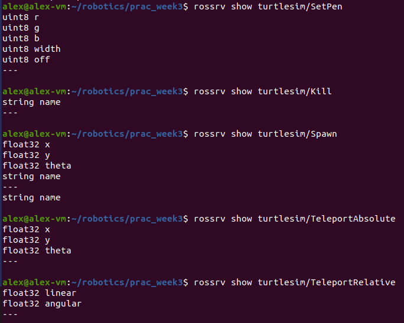
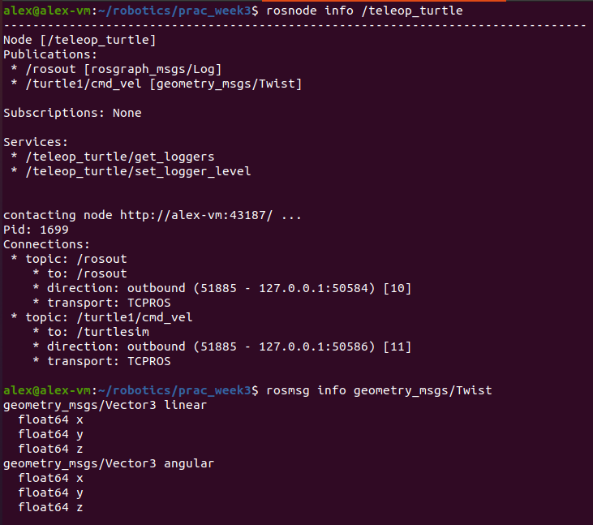

# Week 3 Practical

## 1 More ROS Command-line Tools

### 1.1.1.1



### 1.1.1.2

__/kill__  
`turtlesim/Kill`

__/spawn__
`turtlesim/Spawn`

__/turtle1/teleport_absolute__
`turtlesim/TeleportAbsolute`

__/turtle1/teleport_relative__
`turtlesim/TeleportRelative`

__/turtle1/set_pen__
`turtlesim/SetPen`

### 1.1.2.1



### 1.1.2.2

```
turtlesim/Kill

[REQUEST]
{
	"name": string
}

[RESPONSE]
```

```
turtlesim/Spawn

[REQUEST]
{
	"x": float32,
	"y": float32,
	"theta": float32,
	"name": string
}

[RESPONSE]
{
	"name": string
}
```

```
turtlesim/SetPen

[REQUEST]
{
	"r": uint8,
	"g": uint8,
	"b": uint8,
	"width": uint8,
	"off": uint8
}

[RESPONSE]
```

```
turtlesim/TeleportAbsolute

[REQUEST]
{
	"x": float32,
	"y": float32,
	"theta": float32,
}

[RESPONSE]
```

```
turtlesim/TeleportRelative

[REQUEST]
{
	"linear": float32,
	"angular": float32,
}

[RESPONSE]
```

## 2 Passing Messaages Between Nodes

### 2.1.1

The `turtlesim` node is able to pick up messages from the `teleop_turtle` node because it subscribes to the `turtle1/cmd_vel` topic which `teleop_turtle` publishes messages to.

### 2.1.2

The `turtle1/cmd_vel` topic.

### 2.1.3



### 2.1.4
This command outputs the messages that are being published to the given topic. In this case, it outputs messages that are being published to the `turtle1/cmd_vel` topic.

## 2.2 Publishing Messages from the Command Line

### 2.2.1
This command `rostopic pub -l /turtle1/cmd_vel geometry_msgs/Twist -- '{linear: {x: 1.1, y: 0.0, z: 0.0}, angular: {x: 0.0, y: 0.0, z: 1.0}}'` is publishing a message to the `turtle1/cmd_vel` topic. The type of the message is `geometry_msgs/Twist` which has a data structure that tells the turtle how much to turn, and which direction to move in.

This data is published to the topic, which the turtle subscribes to and with this data it executes the movement.
