# Week 4

## 1 Making A `catkin` Workspace

### 1.1.3
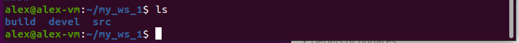

### 1.1.3

(a) Source files are located in the `src` folder. This folder is for checkout, clone and extracting source code.  
(b) Binaries are in the `build` folder and this is where files in the `src` folder are compiled.  
(c) The CMake build system is invoked in the `build` folder.  
(d)
  i. Users should only edit files in the `src` folder  
  ii. Users should not edit files in the `devel` and `build` folders  
  iii. These files are edited by the ROS system when code is compiled and run.  
(e) This command created the `install` folder. Builds are installed here and it is very similar to the `devel` folder.

### 1.2

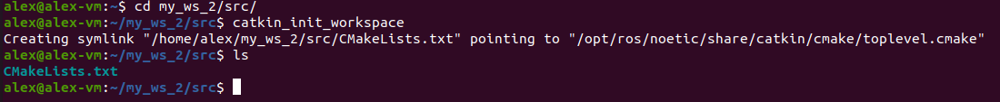

(a) It created a symlink to the `catkin` package and it also created the file `CMakeLists.txt`  
(b) `catkin_make` handles creating the entire workspace including the extra `build` and `devel` folders. `catkin_init_workspace` only creates the `CMakeLists.txt` file in the src directory.  
(c) Yes the outcome of `catkin_init_workspace` is also include in `catkin_make`. The symlink to the `catkin` package that we see in the response to 1.2(a) is also included as part of the `catkin_make` command.

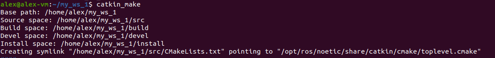

## 2 Creating Ros Packages

### 2.1


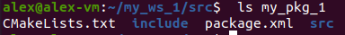

### 2.2

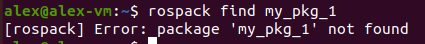

(a) The workspace was not already registerd within the ROS system.  
(b) We need to run the following commands
```
source /opt/ros/noetic/setup.bash
source ~/my_ws_1/devel/setup.bash
rospac profile
```

(c) 
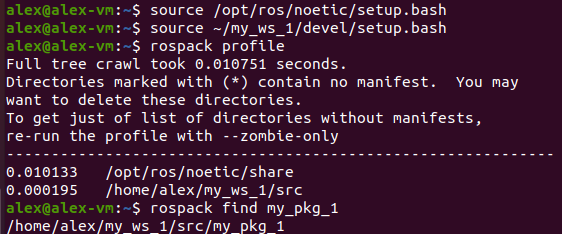

## 3 Building Actual ROS Nodes from A Package

### 3.2.2
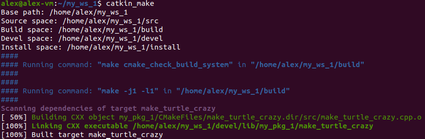

### 3.3.2

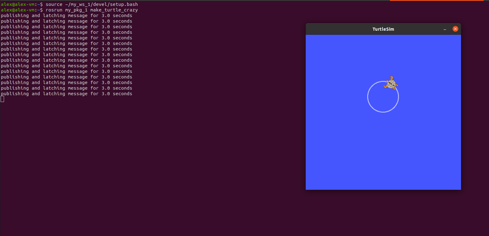
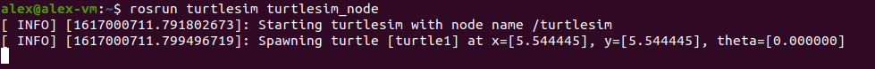
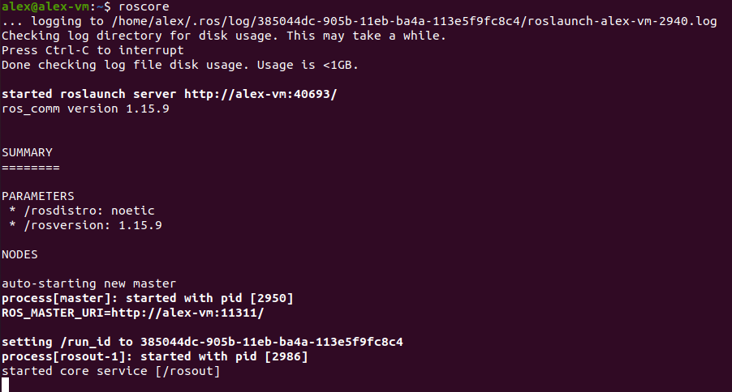

Yes the turtle is still turning the full 360 degrees. It is doing it repeatedly while the package is running.

## 4 Overlaying Workspaces

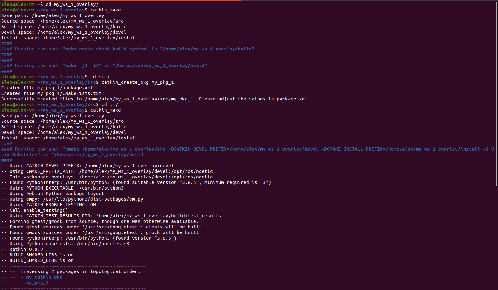

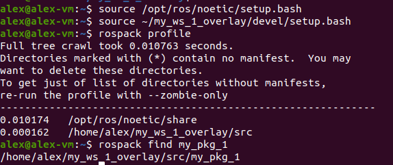

Yes I do think that it has properly overlaid because `my_pkg_1` is now available as a package for the `my_ws_1_overlay` workspace.
