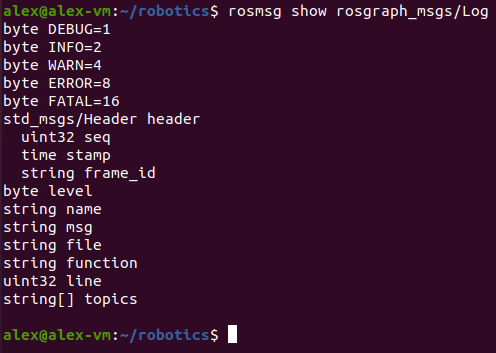
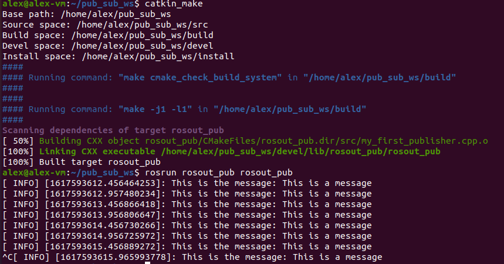
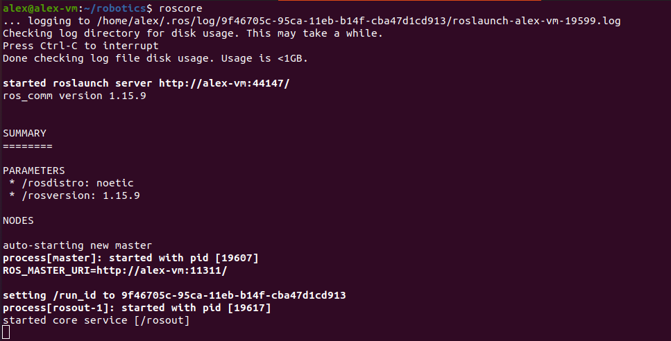
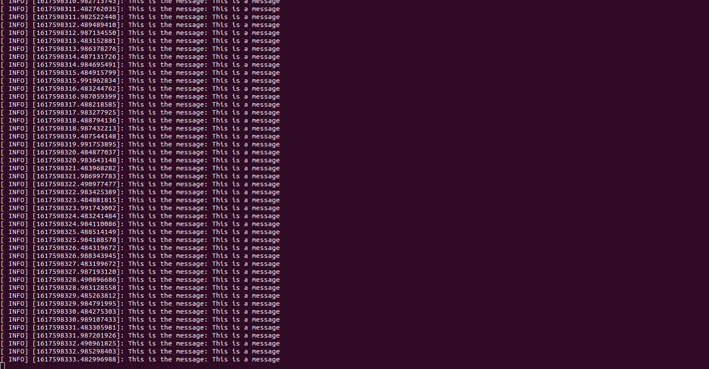
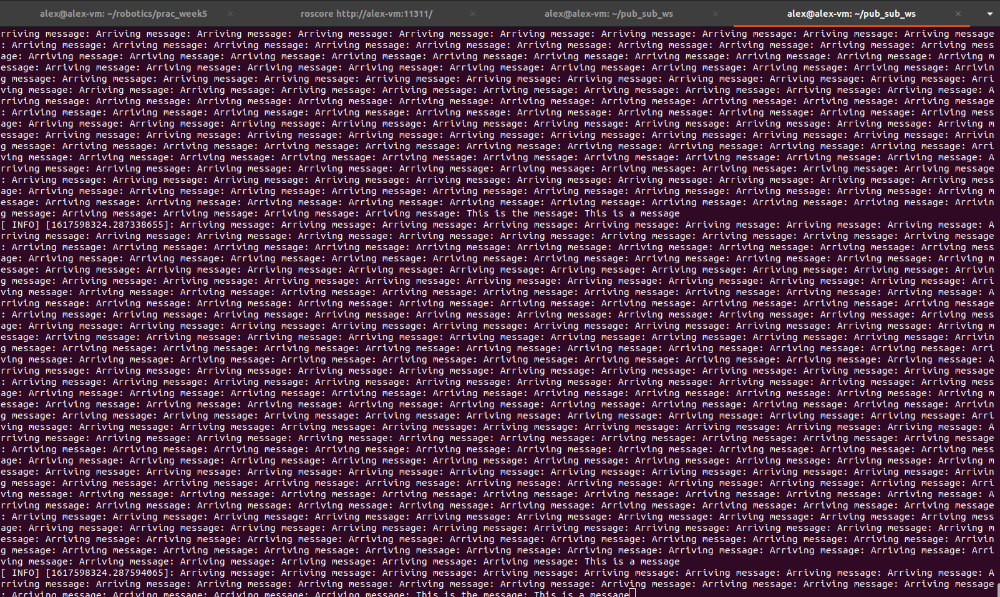
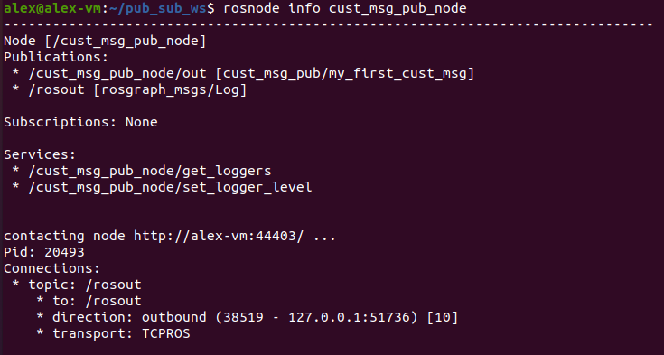
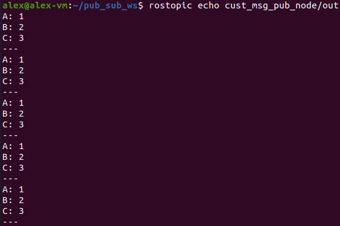

# 1 Building a Publisher Node

## 1.1.2
The `/rosout` node publishes to the `/rosout_agg` topic.

## 1.1.3

(a) `rosgraph_msgs/Log`  
(b)   
(c) `rosgraph_msgs`  

## 1.3.4

# 2 Building a Subscriber Node

## 2.2

## 2.2.3

The `rosout_pub` node is publishing a `rosgraph_msgs/Log` msg to the `rosout_agg` topic at a rate of 2Hz. The `rosout_sub` node is listening to the same topic and is continually calling the poseMsgReceived callback which takes the `rosgraph_msgs/Log` message structure as an argument. Because this callback is being called faster than the 2Hz rate, we end up with lots of extra output where there is no message from the `rosout_pub` node.

# 3 Using Custom Message Types

## 3.2

