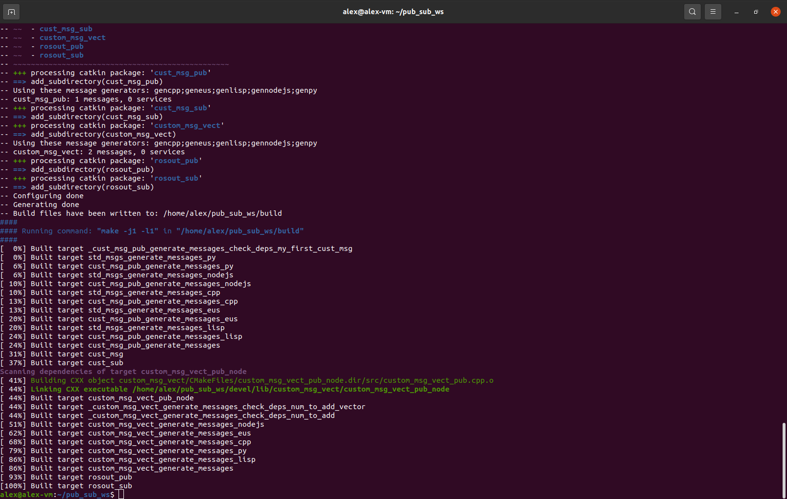
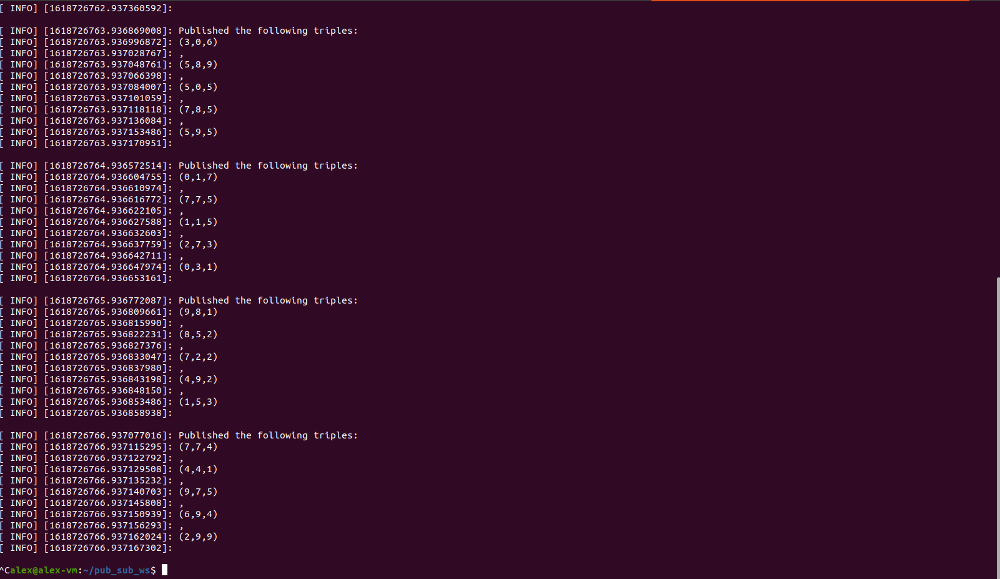
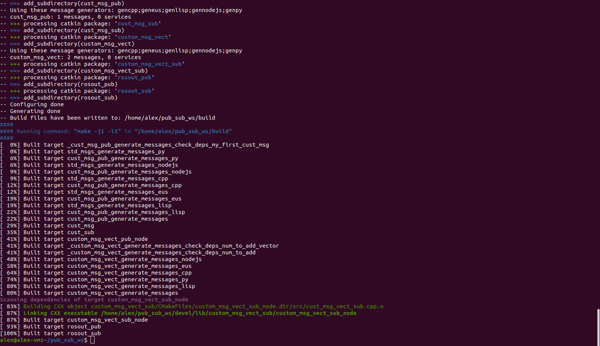
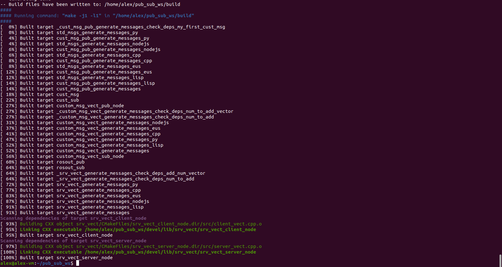

# Week 7 Prac

## 1.2.2

## 1.2.3

## 1.3.3

## 1.3.4

## 1.3.5
`cust_msg_vect_sub` is subscribing to the `cust_msg_vect_pub_node/out` topic. When the `cust_msg_vect_pub` node publishes to this topic, the subscriber node hears it and and we get what is shown above.

## 2.2.2

## 2.2.3

The `client_vect` and `server_vect` nodes are communicating via the `srv_vect_node/add_num_vector` service which defined in **2.1**. We defined the publisher and subscriber message types in the `add_num_vector.srv` file so that the nodes that use the service know what they should be sending/receiving.
